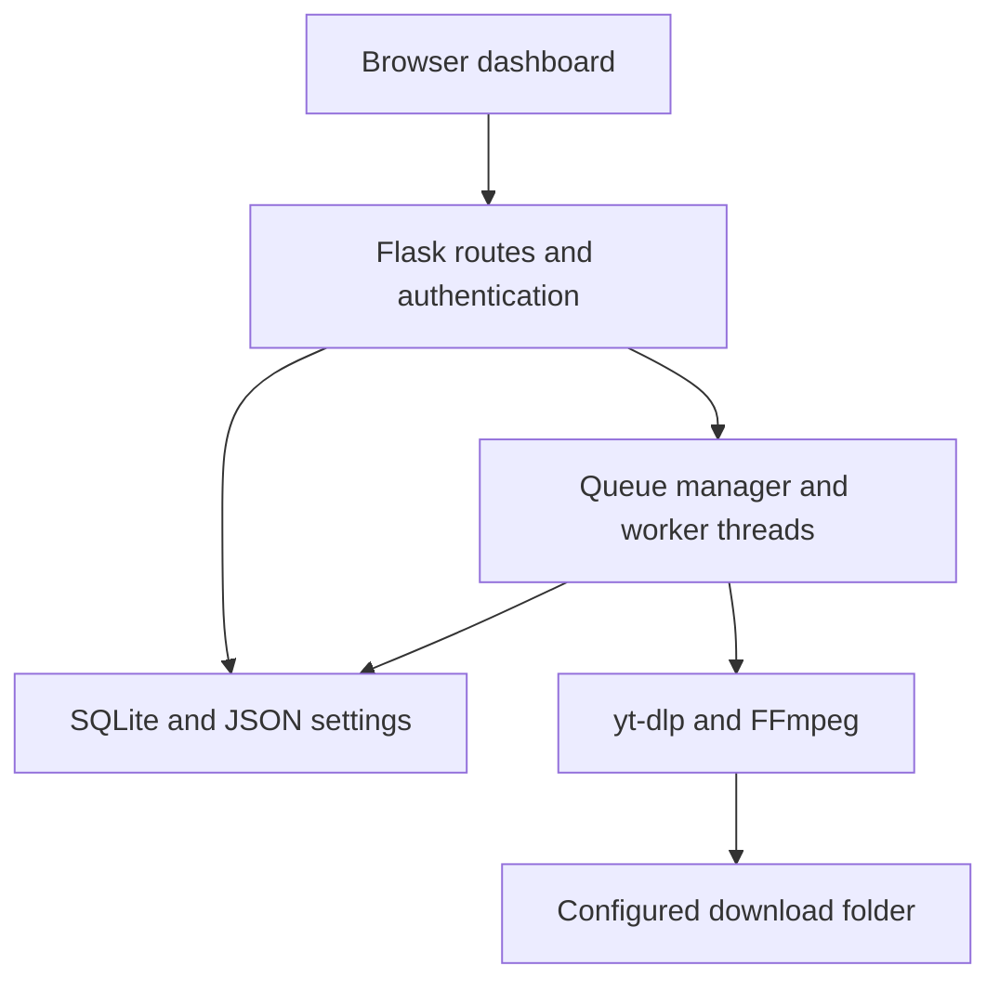

<div align="center">

# REEL

### Personal Media Downloader

**Choose your format. Control your queue. Keep your downloads organised.**

A Python web application for inspecting media links, downloading video and audio,<br>
and managing conversion jobs through an authenticated browser dashboard.


[Features](#features) · [Architecture](#architecture) · [Quick start](#quick-start) · [Configuration](#configuration) · [Testing](#testing) · [Roadmap](#roadmap)

</div>

---

## Overview

Reel brings link inspection, format selection, background downloads and media conversion into one browser interface. It is designed as a **personal, single-account application** that runs on your computer or a server you control.

The repository is named `MyVideoDownloader`; **Reel** is the name used in the application interface.

The project demonstrates practical full-stack development: Flask application structure, JSON APIs, session authentication, concurrent background work, filesystem handling and regression testing. **yt-dlp handles platform extraction; FFmpeg handles media processing; Reel provides the application workflow around them.**

| Inspect | Download | Manage |
| :--- | :--- | :--- |
| Preview titles, thumbnails and available source formats | Choose video or audio output and queue work | Monitor progress, retry failed jobs and review history |
| Compare resolution, FPS, codecs and reported sizes | Process individual links or playlist selections | Configure destinations, concurrency and download dependencies |

## Features

| Capability | What is implemented |
| :--- | :--- |
| **Video downloads** | MP4 and WebM output, automatic selection and exact source-format selection for individual videos |
| **Audio extraction** | MP3, M4A, WAV and FLAC; best quality or bitrate options where applicable |
| **Format inspection** | Resolution, frame rate, source container, codec, HDR information and size when reported by the source |
| **Playlist controls** | Single item, entire playlist or selected indexes such as `1,3,5-8` |
| **Download queue** | Configurable concurrency from 1 to 10; pause waiting jobs, resume, cancel and retry |
| **Progress dashboard** | Status, percentage, download speed, ETA and aggregate queue statistics |
| **Search** | Search YouTube and load a result into the download form |
| **History** | SQLite-backed records with saved paths, redownload actions and record deletion |
| **File destinations** | A default folder in Settings, an optional per-download override and browser copy links |
| **Media extras** | English subtitles where available, metadata, compatible thumbnail embedding and optional SponsorBlock |
| **Authentication** | One username/password account, protected routes, signed sessions and CSRF protection |
| **Preferences** | Light/dark themes and persisted download settings |
| **Diagnostics** | FFmpeg, JavaScript runtime and package checks; a yt-dlp update action |

### Platform support

Reel uses the installed yt-dlp extractors. A supported platform does not guarantee that every post is accessible or downloadable.

| Platform | Project status |
| :--- | :--- |
| **YouTube** | Primary workflow, including search and playlist controls; successful local downloads have been reported by the project owner |
| **Instagram, X/Twitter and Facebook** | Links are passed to yt-dlp; coverage depends on its extractors, the individual post and the account/session. End-to-end support is not independently verified for every platform |
| **Dropbox and TeraBox** | Dedicated integrations are not implemented or verified; these remain roadmap items |

Login-dependent media may require cookies from an account authorised to view it. Reel's own login protects the dashboard; it does not sign you into a media platform. See the [upstream supported-sites list](https://github.com/yt-dlp/yt-dlp/blob/master/supportedsites.md) for extractor coverage.

## Architecture

The Flask application factory registers page, authentication and API blueprints. Services separate extraction, job orchestration, persistence and configuration from request handling.



The dashboard polls the queue API for progress. A separate Server-Sent Events endpoint is also available for individual tasks.

### Engineering decisions

| Decision | Purpose |
| :--- | :--- |
| **Background worker threads with a concurrency limit** | Keep download and conversion work outside the request handler while controlling simultaneous jobs |
| **Literal source-format IDs** | Preserve the selected source stream without interpreting user input as a format-selector expression |
| **Final-file tracking after processing** | Serve the file reported by the current job rather than guessing the newest file in a directory |
| **Unique output filename suffixes** | Reduce collisions between simultaneous downloads and different quality selections without adding task subfolders |
| **Explicit destination errors** | Report missing or unwritable folders instead of silently saving elsewhere |
| **Persistent account and session key** | Retain login configuration across restarts and invalidate existing sessions when the account is reset |
| **Single server process** | Keep the in-memory queue consistent; the current design does not use an external task broker |

## Technology stack

| Layer | Technology | Responsibility |
| :--- | :--- | :--- |
| Backend | Python 3.11+, Flask, Jinja | Routing, rendered pages, JSON APIs and application lifecycle |
| Media extraction | `yt-dlp[default]` | Metadata, available formats, playlists and downloads |
| Media processing | FFmpeg and ffprobe | Conversion, stream merging, metadata and supported embedding |
| JavaScript runtime | Node.js 22+ or Deno 2.3+ | Runtime support used by the application's YouTube extraction setup |
| Frontend | HTML, CSS and vanilla JavaScript | Dashboard, forms, API calls, progress and themes |
| Persistence | SQLite and JSON | Account, download history and settings |
| Configuration | `python-dotenv` | Local environment settings loaded before configuration |
| Serving | Waitress | Optional single-process WSGI server, including on Windows |
| Development | pytest and Ruff | Regression tests and Python linting |

Dependency ranges are maintained in [requirements.txt](requirements.txt) and [requirements-dev.txt](requirements-dev.txt). The frontend has no npm build step; Node.js, when selected, is an extraction runtime.

## Quick start

### Prerequisites

Install these on the machine that will run the backend:

- [Python 3.11 or newer](https://www.python.org/downloads/).
- [FFmpeg](https://ffmpeg.org/download.html), including both `ffmpeg` and `ffprobe` on `PATH`.
- Either [Node.js 22 or newer](https://nodejs.org/en/download) or [Deno 2.3 or newer](https://docs.deno.com/runtime/getting_started/installation/).

Clone this repository using its GitHub **Code** URL, or download and extract it. Open a terminal in the project root. Reopen your terminal after installing dependencies so it picks up `PATH` changes.

### Windows / PowerShell

```powershell
py -m venv .venv
.\.venv\Scripts\python.exe -m pip install --upgrade pip
.\.venv\Scripts\python.exe -m pip install -r requirements.txt

# Create local configuration without overwriting an existing .env.
if (-not (Test-Path .env)) { Copy-Item .env.example .env }

.\.venv\Scripts\python.exe manage.py set-user
.\.venv\Scripts\python.exe run.py
```

These commands do not require virtual-environment activation, so PowerShell activation restrictions do not prevent setup.

<details>
<summary><strong>Linux / macOS setup</strong></summary>

```bash
python3 -m venv .venv
.venv/bin/python -m pip install --upgrade pip
.venv/bin/python -m pip install -r requirements.txt

if [ ! -f .env ]; then cp .env.example .env; fi

.venv/bin/python manage.py set-user
.venv/bin/python run.py
```

</details>

The account command prompts for a username and password. Usernames accept 3–64 letters, numbers, dots, underscores or hyphens; passwords require 10–256 characters. Password entry is hidden. There is **no default account or public registration page**.

Open **[http://127.0.0.1:5000](http://127.0.0.1:5000)**, sign in, then check **Settings → Download engine** for missing dependencies.

### First download

1. Set an existing, writable **Default download folder** in Settings and save it.
2. Paste a media link or select a YouTube search result.
3. Choose an output format and available quality. For playlists, select all items or an index range.
4. Add the job to the queue and monitor its progress.
5. Find the completed file at the displayed path. Use **Save a copy** if you also want a browser download.

> **Where files go:** the selected folder belongs to the machine running Python. A browser copy goes to the browser's own download location. A per-download folder overrides Settings; changing Settings does not move existing files.

## Configuration

Edit `.env` in the project root and restart the app after changes. Existing environment variables take precedence over `.env`. Use absolute paths for custom storage locations.

| Variable | Default | Purpose |
| :--- | :--- | :--- |
| `HOST` / `PORT` | `127.0.0.1` / `5000` | Listening address and port |
| `FLASK_DEBUG` | `false` | Local development debugging |
| `DOWNLOAD_FOLDER` | Project `downloads/` | Initial download folder; a saved Settings value takes precedence for queued jobs |
| `DATA_DIR` | Project `data/` | Account, history, settings and generated session key |
| `LOG_DIR` / `LOG_LEVEL` | Project `logs/` / `INFO` | Application logging |
| `MAX_CONCURRENT_DOWNLOADS` | `3` | Initial concurrency setting; adjustable in Settings |
| `MAX_HISTORY_ITEMS` | `500` | Maximum retained history records |
| `FFMPEG_LOCATION` | Auto-detected | Optional FFmpeg installation location |
| `JS_RUNTIME` / `JS_RUNTIME_PATH` | `auto` / unset | Runtime selection and optional executable path |
| `YTDLP_CHANNEL` | `stable` | Update channel: `stable` or `nightly` |
| `COOKIES_FROM_BROWSER` | Unset | Read cookies from a supported local browser |
| `COOKIES_FILE` | Unset | Path to a Netscape-format cookies file |
| `SECRET_KEY` | Generated and persisted | Flask session-signing key |
| `SESSION_COOKIE_SECURE` | `false` | Enable for HTTPS deployments |
| `SPONSORBLOCK_DEFAULT` | `false` | Initial SponsorBlock preference |

See [.env.example](.env.example) for copyable examples. The complete configuration is defined in [app/config.py](app/config.py).

<details>
<summary><strong>Using your own platform login cookies</strong></summary>

Configure one method at a time. For a private cookies file:

```dotenv
COOKIES_FROM_BROWSER=
COOKIES_FILE=C:/Users/YourName/DownloaderPrivate/x-cookies.txt
```

Alternatively, when the browser exists on the backend machine:

```dotenv
COOKIES_FROM_BROWSER=firefox
COOKIES_FILE=
```

Browser extraction depends on the operating system, browser profile and cookie encryption. On a hosted server, a cookies file must exist on that server; it cannot read the browser on your phone or laptop. Expired sessions may require refreshed cookies.

Keep cookies outside the repository and any publicly served folder. Never share cookies, passwords or session headers in issues. Anyone able to use this personal app may benefit from the access granted by its configured platform session.

See [yt-dlp's cookie documentation](https://github.com/yt-dlp/yt-dlp/wiki/FAQ#how-do-i-pass-cookies-to-yt-dlp).

</details>

## Authentication and storage

- **Single local account:** passwords are hashed using Werkzeug's scrypt default and stored in `data/auth.db`.
- **Protected application routes:** the dashboard, APIs, file downloads, settings and updater require authentication.
- **Session controls:** 12-hour sessions, HttpOnly cookies, SameSite=Lax and CSRF validation for state-changing requests.
- **Login throttling:** five attempts per client IP per five minutes; tracked in memory and reset on process restart.
- **Account reset:** rerun `manage.py set-user` to replace the account and invalidate previous sessions without deleting download history.

| Location | Contents | Persists across restart? |
| :--- | :--- | :--- |
| `data/auth.db` | Account and password hash | Yes |
| `data/app.db` | Download history | Yes |
| `data/settings.json` | User preferences | Yes |
| `data/session.key` | Generated session-signing key | Yes |
| `logs/app.log` | Application and extraction logs | Yes |
| Configured download folder | Media files and available sidecars | Yes |
| Process memory | Queue state and login throttle | No |

The persistence column assumes storage survives the host's restart. Ephemeral hosting filesystems do not provide that guarantee. Local databases, logs, downloads, `.env` and credentials should remain outside source control.

Media requests go to the source platforms. The browser also requests thumbnails and Google Fonts. SponsorBlock requests occur when that option is enabled.

## Project structure

| Path | Responsibility |
| :--- | :--- |
| `app/factory.py` | Application creation, blueprint registration and response headers |
| `app/config.py` | Environment loading and central configuration |
| `app/extensions.py` | Initialisation of shared services |
| `app/routes/` | Page, authentication and API handlers |
| `app/models/schemas.py` | Download requests, queue items and task states |
| `app/services/auth.py` | Account persistence, sessions, CSRF and login throttling |
| `app/services/queue_manager.py` | Worker scheduling, concurrency and task lifecycle |
| `app/services/downloader.py` | yt-dlp integration, FFmpeg options and final-file tracking |
| `app/services/media_formats.py` | Public source-format metadata and exact format selection |
| `app/services/history.py` | SQLite download history |
| `app/services/settings_store.py` | JSON-backed preferences |
| `app/services/diagnostics.py` | Dependency and runtime checks |
| `app/services/search.py` | YouTube search integration |
| `app/templates/` | Login page and dashboard templates |
| `app/static/` | Stylesheets and JavaScript modules |
| `tests/` | Authentication, API, format and download regression tests |
| `manage.py` | Account creation and reset command |
| `run.py` / `serve.py` | Development and Waitress entry points |

<details>
<summary><strong>Selected API endpoints</strong></summary>

All endpoints below require an authenticated session. State-changing requests also require the session's CSRF token, supplied by the frontend using `X-CSRF-Token`.

| Method | Endpoint | Purpose |
| :--- | :--- | :--- |
| `GET` | `/api/info` | Inspect a media URL and available formats |
| `GET` | `/api/formats` | List output containers and quality presets |
| `POST` | `/api/download` | Validate and enqueue a download request |
| `GET` | `/api/queue` | Retrieve queue items and statistics |
| `GET` | `/api/progress/<task_id>` | Stream one task's progress using SSE |
| `POST` | `/api/queue/<task_id>/<action>` | Actions: `pause`, `resume`, `cancel` or `retry` |
| `GET` | `/api/download-file/<task_id>?index=0` | Serve a completed media file |
| `GET` | `/api/search` | Search YouTube |
| `GET`, `DELETE` | `/api/history` | Read or clear history records |
| `POST` | `/api/history/<entry_id>/redownload` | Queue a fresh download using saved output settings |
| `GET`, `POST` | `/api/settings` | Read or update persisted preferences |
| `GET` | `/api/system-status` | Check installed dependencies |
| `POST` | `/api/update-ytdlp` | Update the extractor package; restart required |

The complete route definitions are in [app/routes/api.py](app/routes/api.py).

</details>

## Testing

The latest recorded validation run passed **55 Python tests** on Linux. Tests cover authentication and CSRF, queue lifecycle regressions, format selection, destination handling, concurrent downloads and file serving.

Integration tests generate synthetic media using FFmpeg and serve it over local HTTP. They exercise real downloads and conversion to **MP4, WebM, MP3, M4A, WAV and FLAC**, without third-party media or credentials.

```powershell
.\.venv\Scripts\python.exe -m pip install -r requirements-dev.txt
.\.venv\Scripts\python.exe -m pytest -q
.\.venv\Scripts\python.exe -m ruff check app tests manage.py run.py serve.py
```

On Linux/macOS, replace `.\.venv\Scripts\python.exe` with `.venv/bin/python`. FFmpeg and ffprobe must be available for the media integration tests.

**Validation scope:** simulated DOM interaction checks were also performed. Full browser rendering, Windows execution and comprehensive live-platform compatibility are not covered by the recorded automated run. See [VALIDATION.md](VALIDATION.md) for the test environment and limitations.

## Deployment

For personal use with a WSGI server:

```powershell
.\.venv\Scripts\python.exe serve.py
```

- Run **one server process**: the queue is stored in memory and is not shared between processes.
- Use persistent storage for `DATA_DIR`, logs and downloads.
- For remote access, configure HTTPS, set `SESSION_COOKIE_SECURE=true`, keep debugging disabled and restrict access to the intended user.
- Install Python, FFmpeg and the selected JavaScript runtime on the host. Store platform cookies privately on that host.
- GitHub Pages can host static project documentation, but cannot run this Python backend or its conversion jobs.

This is a personal application, not a multi-user download service. Horizontal scaling would require shared job coordination and changes to persistence and authentication.

## Troubleshooting

| Symptom | What to check |
| :--- | :--- |
| **FFmpeg missing** | Install both `ffmpeg` and `ffprobe`, check `PATH` or `FFMPEG_LOCATION`, then restart |
| **YouTube runtime warning** | Install a runtime supported by the app and the `yt-dlp[default]` dependencies; refresh Download engine diagnostics |
| **HTTP 403 or extraction failure** | Check the full error, installed extractor version and whether the same media plays with your account; an update is not a guaranteed fix |
| **X reports no video found** | Confirm the exact post contains playable video; login-dependent posts may need your own platform cookies |
| **Unexpected download location** | Check Settings and the optional folder override; a browser copy uses the browser's destination |
| **Selected source format unavailable** | Refresh the link preview and select a currently available format |
| **Session expired during sign-in** | Reload the login page to get a fresh CSRF token; use a consistent hostname and check that cookies are enabled |
| **Folder picker does not open on a server** | Type an existing absolute server path; the native picker requires a desktop display |

To update the download engine, finish or clear queued work, stop the app and run:

```powershell
.\.venv\Scripts\python.exe -m pip install --upgrade "yt-dlp[default]"
```

Restart afterwards. The in-app updater also requires a restart. Check `logs/app.log` for the underlying error; when reporting an issue, include dependency versions and a redacted error message rather than cookies or request headers.

## Known limitations

- Pause applies to **waiting jobs**, not downloads already running. Cancellation is cooperative and may leave partial or completed files on disk.
- Queue state and browser copy links are lost on restart. History and existing files remain if their storage persists. Clearing queue/history records does not delete media.
- Source sizes may be estimates and can exclude separate audio. Final file sizes can change after merging or conversion.
- Playlists use per-video maximum quality caps. A selected resolution cannot create detail absent from the source, and WAV/FLAC conversion cannot restore information lost in compressed audio.
- Output containers do not guarantee codec compatibility on every player. Cross-format conversion may take significant processing time.
- Availability depends on upstream extractors, the source media, login state and network conditions. DRM formats are excluded from source-format choices.

## Roadmap

Planned directions, not promises of current support:

- [ ] Verify and improve Instagram, X and Facebook workflows with platform-specific regression cases.
- [ ] Add dedicated Dropbox and TeraBox workflows where supported.
- [ ] Persist queued jobs and recover interrupted work after restart.
- [ ] Add download retention and storage-usage controls.
- [ ] Add automated full-browser UI checks and continuous integration.

## Contributing and project notes

Issues and focused pull requests are welcome. Describe the expected behaviour, actual result, dependency versions and steps to reproduce. Add regression coverage when changing queue, authentication or file-handling behaviour.

Reel builds on [Flask](https://flask.palletsprojects.com/), [yt-dlp](https://github.com/yt-dlp/yt-dlp), [FFmpeg](https://ffmpeg.org/) and other dependencies listed above. Their licences and terms apply independently. No project-level `LICENSE` file is currently included in this repository.

Use Reel for media you own or have permission to download, subject to the source platform's terms.

---

<div align="center">

**Reel · Personal media tools, with visible progress and control.**

[Back to top](#reel)

</div>
